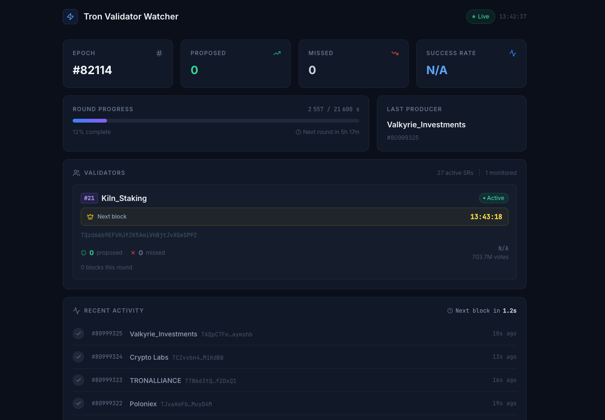

# 🚀 Tron Validator Watcher

**Tron Validator Watcher** is a powerful Prometheus Exporter designed to help you efficiently monitor your validators on the Tron blockchain. It comes with a built-in real-time web dashboard for instant visibility into block production performance.

## 🌟 Features

- **Real-time dashboard** — React-based UI showing live block production stats, missed blocks, validator rankings, and recent activity
- **Per-validator metrics** — Track proposed/missed blocks, consecutive misses, and next scheduled slot per validator
- **Missed block detection** — Detects skipped slots by checking for timestamp gaps between consecutive blocks
- **Prometheus metrics** — Full set of Prometheus counters and gauges for alerting and Grafana dashboards
- **Multi-validator support** — Monitor multiple Tron Super Representatives simultaneously
- **Round awareness** — Tracks epoch changes, refreshes validator ranks each round

## 📋 Prerequisites

To use **Tron Validator Watcher**, you need:

- A running **Tron RPC node**, either:
  - A local node, fully synchronized with the network.
  - A remote provider such as **QuickNode**, **TronGrid**, or other Tron RPC services.
- **Go 1.24+** installed _(for development purposes only)_.
- **Node.js 18+** _(only if building the frontend from source)_
- **Make**
- **Docker** if you want to build local images

## 📦 Installation

### Manual Installation (Development)

```sh
git clone https://github.com/kilnfi/tron-validator-watcher.git
cd tron-validator-watcher
make build
```

### Releases

With each release, we provide precompiled binaries for various platforms, making it easy to install and use Tron Validator Watcher without needing to build from source.

You can find the latest releases here: [Tron Validator Watcher Releases](https://github.com/kilnfi/tron-validator-watcher/releases).

## 🚀 Usage

```bash
Usage:
  tron-validator-watcher [flags]

Flags:
      --block-watcher-enabled                enable block watcher (default true)
      --block-watcher-refresh-interval int   block watcher refresh interval in seconds (default 30)
      --config-file string                   config file (default is config.yml)
  -h, --help                                 help for tron-validator-watcher
      --http-server-host string              HTTP server host
      --http-server-port int                 HTTP server port (default 8080)
      --log-level string                     log level (debug, info, warn, error, fatal, panic) (default "info")
      --rpc-endpoint string                  block watcher API URL
```

Run the tool with:

```sh
./tron-validator-watcher --config-file=config.yaml
```

### Available Flags

| Flag                                  | Type   | Description                                          | Default      |
| ------------------------------------- | ------ | ---------------------------------------------------- | ------------ |
| `--config-file`                       | string | Path to the configuration file                       | `config.yml` |
| `--block-watcher-enabled`             | bool   | Enable block watcher                                 | `true`       |
| `--block-watcher-refresh-interval`    | int    | Block watcher refresh interval in seconds            | `30`         |
| `--http-server-host`                  | string | HTTP server host                                     |              |
| `--http-server-port`                  | int    | HTTP server port                                     | `8080`       |
| `--log-level`                         | string | Log level (`debug`, `info`, `warn`, `error`)         | `info`       |
| `--rpc-endpoint`                      | string | Block watcher API URL                                |              |

## ⚙️ Configuration File

Modify the `config.example.yaml` file and rename it to `config.yaml`. Below is a breakdown of the configuration options:

| Option                           | Description                                                | Example                      |
| -------------------------------- | ---------------------------------------------------------- | ---------------------------- |
| `validators`                     | List of validators to monitor                              | See below                    |
| `validators.address`             | The blockchain address of the validator (Base58)           | `TABC123...XYZ`              |
| `validators.name`                | A human-readable name for the validator                    | `"Validator Name"`           |
| `validators.instance`            | The instance identifier for tracking                       | `"tron-validator-mainnet-0"` |
| `log-level`                      | Logging verbosity level (`debug`, `info`, `warn`, `error`) | `"debug"`                    |
| `http-server.host`               | The host IP address for the HTTP server                    | `"0.0.0.0"`                  |
| `http-server.port`               | The port for the HTTP server                               | `8080`                       |
| `block-watcher.enabled`          | Enables or disables block monitoring                       | `true`                       |
| `block-watcher.refresh-interval` | Interval (in seconds) for polling validator activity       | `10`                         |
| `rpc.endpoint`                   | The RPC node URL for blockchain data retrieval             | `"https://localhost:8090"`   |

### Example `config.yaml`

```yaml
validators:
  - address: "your_validator_address"
    name: "Validator Name"
    instance: "tron-validator-mainnet-0"
log-level: "info"
http-server:
  host: "0.0.0.0"
  port: 8080
block-watcher:
  enabled: true
  refresh-interval: 10
rpc:
  endpoint: "https://localhost:8090"
```

## 🖥️ Dashboard

Tron Validator Watcher includes a built-in web dashboard accessible at `http://localhost:8080`.



### What the dashboard shows

- **Overview stats** — Current epoch, round progress, total proposed/missed blocks, active SR count
- **Per-validator cards** — Each monitored validator shows:
  - SR rank with color coding (top 9 / top 18 / top 27)
  - Blocks proposed and missed this round
  - Consecutive missed blocks
  - Next scheduled block slot time
  - Vote count
  - Link to TronScan
- **Activity feed** — Live stream of recent blocks with proposer name, block number, and timestamp; missed slots highlighted in red
- **Flash animation** — Validator cards flash red on a new missed block

### Building the frontend

The frontend is a React + TypeScript app (Vite + Tailwind CSS). A pre-built version is embedded in the binary via Go's `embed` package. To rebuild it after making changes:

```sh
cd frontend
npm install
npm run build
```

The compiled output goes to `internal/ui/dist/`, which is then embedded into the binary at compile time.

### API endpoint

The dashboard is powered by the `/api/status` JSON endpoint. You can also query it directly:

```sh
curl http://localhost:8080/api/status
```

Example response:

```json
{
  "epoch": 12345,
  "round_progress": 3600,
  "round_duration": 21600,
  "next_round_in_ms": 54000000,
  "proposed_total": 42,
  "missed_total": 1,
  "consec_missed": 0,
  "total_srs": 27,
  "validators": [
    {
      "name": "MyValidator",
      "address": "TXyz...",
      "rank": 5,
      "proposed": 42,
      "missed": 1,
      "consec_missed": 0,
      "is_active": true,
      "vote_count": 1234567890,
      "next_slot_in_ms": 9000
    }
  ],
  "recent_blocks": [
    {
      "number": 68000001,
      "proposer": "MyValidator",
      "address": "TXyz...",
      "is_ours": true,
      "missed": false,
      "timestamp": 1710000000000
    }
  ]
}
```

## 🌡️ Metrics

This exporter provides the following Prometheus metrics, available at `http://localhost:8080/metrics`.

| Metric Name                                                       | Description                                                 | Type        | Labels                                        |
| ----------------------------------------------------------------- | ----------------------------------------------------------- | ----------- | --------------------------------------------- |
| `tron_validator_watcher_block_producer_info`                      | Block producer info                                         | GaugeVec    | `validator_name`, `validator_address`, `rank` |
| `tron_validator_watcher_consecutive_missed_blocks_total`          | Total number of consecutive blocks missed by the validator  | GaugeVec    | `validator_name`, `validator_address`         |
| `tron_validator_watcher_latest_block_processed_by_block_watcher`  | The latest block processed by the block watcher             | Gauge       | —                                             |
| `tron_validator_watcher_missed_blocks_total`                      | Total number of blocks missed by the validator              | CounterVec  | `validator_name`, `validator_address`         |
| `tron_validator_watcher_proposed_blocks_total`                    | Total number of blocks proposed by the validator            | CounterVec  | `validator_name`, `validator_address`         |
| `tron_validator_watcher_round_progress`                           | The current progress within the round (seconds)             | Gauge       | —                                             |

## 🛠 Development

### Running Locally

```sh
git clone https://github.com/kilnfi/tron-validator-watcher.git
cd tron-validator-watcher
make run
```

### Running Tests

```sh
make tests
make coverage
```

## 📜 License

This project is licensed under the [MIT License](LICENSE).

## 🎉 Contributing

Pull requests are welcome! Feel free to open an issue or suggest improvements.
